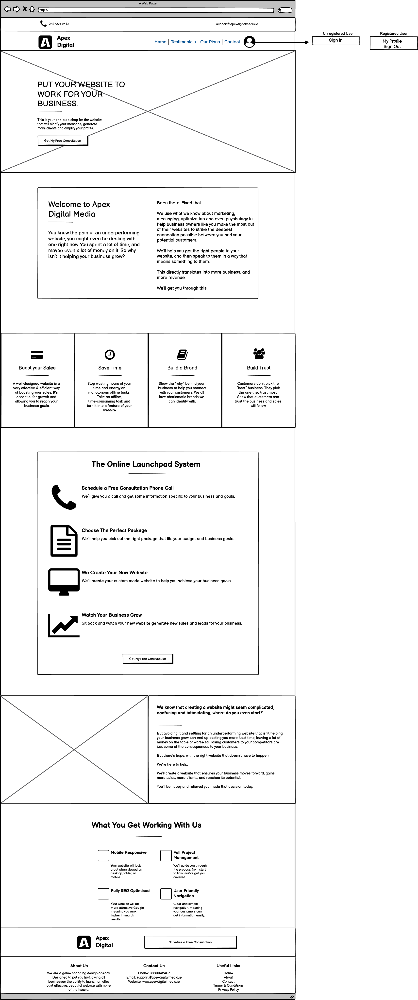
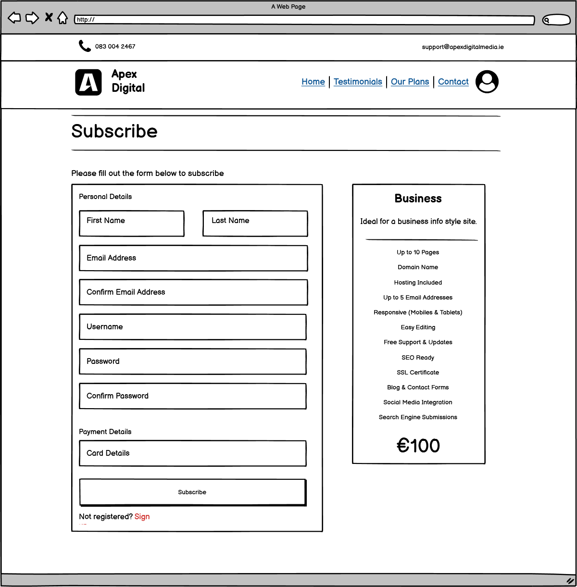
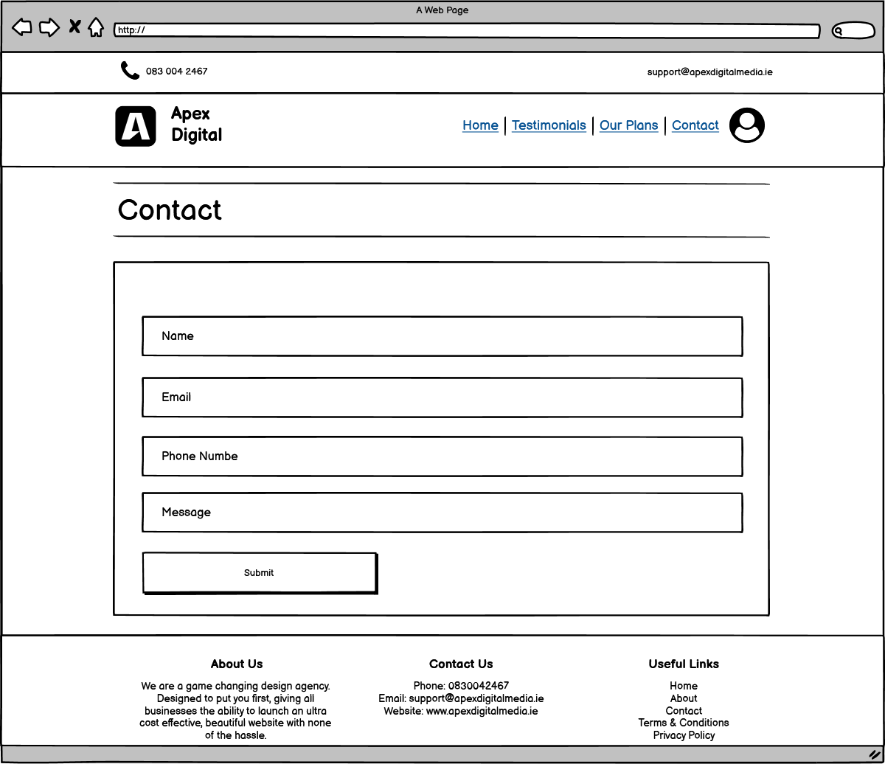
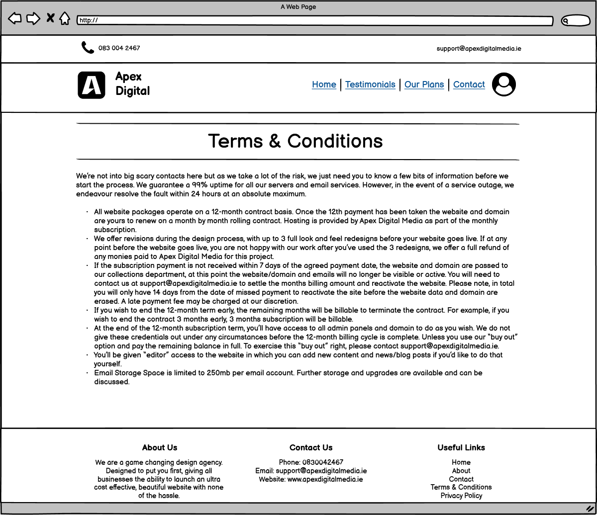

# Apex Digital Media

## Welcome to Apex Digital Media!

<div align="center">
    
</div>

***
### By Jake Reid

## About this project
This project was developed as a final project for a Full Stack Development Diploma with the CodeInstitute. As I currently own a 
web design business I decided to give the current brochure website an update. 

This website was designed to provide a platform for users which offers an affordable way to have a website developed and managed 
through small monthly payments. This structure is known as WaaS (Website as a Service)

***

## Table of Contents:
* [Aim](#aim)
* [User Stories](#user-stories)
* [User Experience](#user-experience)
    * [Design](#design)
        * [Font](#font)
        * [Color Scheme](#color-scheme)
    * [Wireframes](#wireframes)
* [Database](#database)
    * [Schema](#schema)
    * [Table Relationships](#table-relationships)
* [Application Logic](#application-logic)
    * [Apps](#apps)
* [Testing](#testing)
* [Issues](#issues)    
    * [Open](#open)    
    * [Closed](#closed)    
* [Technology Used](#technology-used)
* [Deployment](#deployment)
* [Credits](#credits)
    * [Inspiration](#inspiration)
    * [Media](#media)
    * [Sources](#sources)
    * [Attribution](#attribution)

***


## Aim
Most people that look to have a website developed genrally don't keep up much if any aftercare and the website 
is left the same as the day it was developed. This leads to a lot of websites being outdated and insecure over time.
The purpose of this website was to provide a website as a service (WaaS) rather than a product. This would allow the client 
to regularly request new changes to the website, ensure their site is secure and up to date and allows for them to 
keep on top of SEO. All of this can be done for small monthly payments rather than a once off lump sum.

Upon subscription the client will be alloted a certain quantity of each service. Some of these services are once off and
others renew at the start of each month. The client will be able to purchase individual services as an add on should they
run out.

This type of structure simplifies the web development process for both the developer and the client. During web development 
there can be a lot of back and forth communication and some details can be lost in the process. This can lead to disputes
over what was initially agreed upon when handing over the finished website. With the WaaS approach this is not an issue
as the client can continually request changes. This approach also allows for a lot of transparency as the user can easily
identify all costs involved.

To prevent against scenarios where a client will sign up and cancel once the website is built, the client must agree
to enter a contract for a minimum of 1 year. After this the client can cancel their service and they get to keep the website.

***

## User Stories
| ID                             | As A/An    | I want to...                                                                | So I can...                                                                        | Completed             |
| ------------------------------ | ---------- | --------------------------------------------------------------------------- | ---------------------------------------------------------------------------------- | --------------------- |
| Viewing and Navigation         |            |                                                                                                                                                                                          |
| 1                              | User       | View list of packages                                                       | Find something to purchase                                                         | :white_check_mark:    |
| 2                              | User       | View details of package                                                     | See Price, Description, Services, etc                                              | :white_check_mark:    |
| 3                              | User       | See an explanation for WaaS                                                 | Understand the service                                                             | :black_square_button: |
| 4                              | User       | Schedule a consultation                                                     | Discuss with a developer the plan and process for development                      | :white_check_mark:    |
| 5                              | Client     | See my current subscription and available services                          | To know what I can avail of                                                        | :white_check_mark:    |
| 6                              | User       | View a list of previous works and testimonials                              | Judge the quality of the work from the developer                                   | :black_square_button: |
| Subscription and User Accounts |            |                                                                                                                                                                                          |
| 7                              | Client     | Subscribe to a service                                                      | Avail of web design service and provide details for new website                    | :white_check_mark:    |
| 8                              | Client     | Quickly login/out                                                           | Access my account                                                                  | :white_check_mark:    |
| 9                              | Client     | Request a password reset                                                    | receive and email to reset my password in case I forget it                         | :white_check_mark:    |
| 10                             | Client     | Receive an email confirming my payment                                      | Verify my account was created and payment was received                             | :white_check_mark:    |
| 11                             | Client     | Access my user profile                                                      | View my package details, manage my personal details                                | :white_check_mark:    |
| 12                             | Client     | Schedule a call with developer                                              | Discuss over the phone potential changes to be made                                | :black_square_button: |
| 13                             | Client     | Be notified when website is ready for review                                | Approve the final result or request further changes                                | :black_square_button: |
| 14                             | Client     | Avail of a particular service through the dashboard                         | Request updates without the need for a scheduled phone call                        | :white_check_mark:    |
| 15                             | Client     | Submit a testimonial                                                        | Inform others of the experience                                                    | :black_square_button: |
| Admin and Store Management     |            |                                                                                                                                                                                          |
| 16                             | Site Owner | Submit a client's website for approval                                      | Get their feedback                                                                 | :black_square_button: |
| 17                             | Site Owner | Edit/update a product                                                       | Change the price, description, etc of a product                                    | :white_check_mark:    |
| 18                             | Site Owner | Automatically upload clients testimonial                                    | Save time                                                                          | :black_square_button: |
| 19                             | Site Owner | Confirm service request from client and notify them when update is complete | Simplify the working process                                                       | :black_square_button: |
| Purchasing and Checkout        |            |                                                                                                                                                                                          |
| 20                             | Shopper    | Easily enter my payment information                                         | Checkout quickly, without hassle                                                   | :white_check_mark:    |
| 21                             | Shopper    | Feel my payment and personal information is secure                          | Provide the needed payment and personal information, and feel it is handled safely | :white_check_mark:    |
| 22                             | Shopper    | View confirmation of order before completing purchase                       | Verify I haven't made any mistakes                                                 | :white_check_mark:    |
| 23                             | Shopper    | Receive confirmation email after checking out                               | To keep my own record of the purchase                                              | :white_check_mark:    |
| 24                             | Client     | Purchase additional services, should they run out                           | So I do not need to wait for the next month to avail of a service                  | :black_square_button: |

***

## User Experience

### Design
For this type of service a dashboard log in area for both the client and the developer seemed like the most logical choice.
Once the client is logged in they will be able to:
* View their profile information
* See the details for the current websites they have purchased
* View the amount of remaining services available for each website
* Submit a testimonial

Once the devloper is logged in they will be able to:
* See and modify a list of current packages available to purchase
* See a list of the current service requests from users
* See a list of all client websites that are still under develoment
* Mark a development website as done and have the user notified with a link to the new website
* See a list of negative testimonials from clients.

The reason why only negative testimonials will show in the developer dashboard is so the developer can make improvements based on
what the client was not happy about. If the client had gave a positive testimonial they will be redirected to the Google 
Business review page. This will help to build good SEO as most public reviews will be positive.

Outside of the dashboard the website will be pretty simple with a homepage, about us, packages and a contact page.

***

#### Fonts
The font used on this site was the Montserrat font designed by Julieta Ulnavosky. The inspiration for this font was from traditional posters
and signs. As such the Montserrat font is a great font for readability and is generally regarded as one of the best fonts to use.

Only one font was used as using many fonts can make a website look unstructured and messy.

***

#### Colour Scheme
The colour scheme used for this website is pretty simple.
Primary colour: #ab122b
Secondary colour: #fffff
Form colour: rgba(0,0,0,0.6)
Footer colour: #222222

***

### Wireframes

<details closed>
<summary>Homepage</summary>
   <p align="center">
      
   </p>
<br>
</details>

<details closed>
<summary>Our Plans</summary>
   <p align="center">
      
   </p>
<br>
</details>

<details closed>
<summary>Checkout Page</summary>
   <p align="center">
      
   </p>
<br>
</details>

<details closed>
<summary>Contact</summary>
   <p align="center">
      
   </p>
<br>
</details>

<details closed>
<summary>Log In Page</summary>
   <p align="center">
      
   </p>
<br>
</details>

<details closed>
<summary>Profile - Personal Details</summary>
   <p align="center">
      
   </p>
<br>
</details>

<details closed>
<summary>Profile - Website details</summary>
   <p align="center">
      
   </p>
<br>
</details>

<details closed>
<summary>Profile - Website details Pending</summary>
   <p align="center">
      
   </p>
<br>
</details>

<details closed>
<summary>Profile - Package details</summary>
   <p align="center">
      
   </p>
<br>
</details>

<details closed>
<summary>Profile - Request Service</summary>
   <p align="center">
      
   </p>
<br>
</details>

<details closed>
<summary>Profile - Testimonial</summary>
   <p align="center">
      
   </p>
<br>
</details>

<details closed>
<summary>Profile - Submit Testimonial</summary>
   <p align="center">
      
   </p>
<br>
</details>

<details closed>
<summary>Admin - Package Details</summary>
   <p align="center">
      
   </p>
<br>
</details>

<details closed>
<summary>Admin - Service Requests</summary>
   <p align="center">
      
   </p>
<br>
</details>

<details closed>
<summary>T&C</summary>
   <p align="center">
      
   </p>
<br>
</details>

<details closed>
<summary>Privacy Policy</summary>
   <p align="center">
      
   </p>
<br>
</details>

</details>

***

## Database

### Schema

One user can have many:
* Orders

One UserProfile can have many:
* Websites
* Services

One Website can one:
* Package

One Service can one:
* Package

Packages containe no relations to other tables

***


## Application Logic

### Apps

#### Home Application
This application is used to display the basic pages of the website such as the homepage, our plans and contact page

#### Profiles Application
This application is used to store all the users account information.

#### Packages Application
This application is concerned with adding, editing, deleting and displaying different packages.

#### Checkout Application
This application gives a user the ability to purchase a package using Stripe as a payment processor.

#### Website Details Application
This application allows a user to submit the details of the website they want to designed and to view all of the websites
they have currently purchased.

#### Services Application
This application shows the available services and the quantity thatthe user has left in their subscription.

***

## Testing
Unit testing was used to test the Home, packages and and website_details apps. Unfortunately due to time constraints
a more in depth unit testing could not be performed.

### Home
Ensure that the correct templates are being called for specific views
Ensure that specific form fields are marked as required

### Packages
Ensure that the correct templates are being called for specific views
Ensure that specific form fields are marked as required
Validating that packages can be added, edited and deleted

### Manual Testing
Extensive manual testing of the site was performed throughout development. This involved:
* Testing the that buttons and links redirect to the correct page
* Forms validate users input
* Double payments cannot be made and webhooks create orders in the database when there are issues with checkout form
* Site is responsive overall
* User cannot break the site using back or forward buttons
* Suffiecient error handling is implemented on all edge case scenarios dealing with database data
* User login is required for specific URLs
* Super Users can only access Admin URls

***

## Issues 

### Open  
1. Recurring Payments - This project was originally supposed to use a Stripe recurring payment. Initially I used the content from the Boutique Ado to get 
started with payments with the plan to change to subscriptions further down the line. This proved to be an issue as recurring payments
in Stripe require a lot of customer data to be stored in Stripe. As my customer data was set up to be stored in my database it would 
have been too long and complicated a process to change everything over in time for the projects dealine. So the recurring payments 
will be implemented at a later date.
2. Reseting monthly services - Without the recurring payments it made it difficult to reset the users monthly services. This was to be done when a 
webhook was received from Stripe indicating that the client had paid their next months subscription. Without this webhook the best option would be to
use a task scheduler such as celery to schedule a reset every month. Doing this felt redundant as the Stripe recurring payments will be implemented
in a future update.
3. The testimonial section is not yet implemented due to time constraints. Testimonials can still be given on the businesses Google page so this was
not considered as important to have.
4. The admin dashboard is not implmented due to time constraints. This part was an integral part of the website but unfortunately there was not enough
time to implement it. Instead emails are sent to the admin to notify them of user requests.
5. User account is not created on subscription. Instead the user has to register before subscribing.

***


## Technology Used

[MD Bootstrap](https://mdbootstrap.com/md-bootstrap-cdn/)
* HTML 
* CSS 
* JavaScript 
* Python
* [JQuery](https://jquery.com) - Used to simplify Javascript
* [PostGreSql](https://www.postgresql.org/) - Used as production database
* [SQLite3](https://www.sqlite.org/index.html) - Used as development database
* [Bootstrap](https://getbootstrap.com/) - to help adapt for numerous input types
* [GIT](https://git-scm.com/) - Version Control
* [Django](https://www.djangoproject.com/) - Python Framework
* [Crispy Forms](https://django-crispy-forms.readthedocs.io/en/latest/) - Used for Django forms
* [Allauth](https://django-allauth.readthedocs.io/en/latest/installation.html) - Used for authentication within Django App
* [VSCode](https://code.visualstudio.com/) - IDE for local development
* [GitPod](https://gitpod.io/) - IDE for remote development
* [Heroku](https://heroku.com) - to host the project
* [AWS](https://aws.amazon.com/) - Used to host static files and images
* [Stripe](https://stripe.com/en-ie) - Used to accept web payments
* [FontAwesome](https://fontawesome.com/) - Used for icons
* [Google Fonts](https://fonts.googleapis.com/) - Used for fonts

***

## Deployment

### Install the Heroku CLI
Download and install the Heroku CLI.
If you haven't already, log in to your Heroku account and follow the prompts to create a new SSH public key.
$ heroku login

### Create a new Git repository
Initialize a git repository in a new or existing directory
```
$ cd my-project/
$ git init
$ heroku git:remote -a {project-name}
```

### Create a requirements.txt file
This file contains a list of dependencies. We use this to tell Heroku that we will be using Python in our code.
pip3 freeze --local > requirements.txt

### Create a Procfile
A procfile is a special kind of file that tells Heroku how to run our project. (VS code needs to be in UTF-8 otherwise push will fail.)
Create a new file in the project root called Procfile and enter the following text
```
web: python app.py
```

### Final Production setup
Add environment variables in Heroku. Navigate to the settings tab in Heroku Dashboard and click "Config Vars".
Environment variables used are:
* SECRET_KEY - Secret key for Django Application
* AWS_ACCESS_KEY_ID - Access key for Amazon Web Services
* AWS_SECRET_ACCESS_KEY - Secret key for Amazon Web Services
* DATABASE_URL - URL to Postgress database
* EMAIL_HOST_PASS - Gmail password for external access
* EMAIL_HOST_USER - Hosts email address
* STRIPE_PUBLIC_KEY - Stripe public key
* STRIPE_SECRET_KEY - Stripe secret key
* STRIPE_WH_SECRET_APEX - Stripe webhook
* USE_AWS - Boolean for whether or not to use Amazon Web Services
* DEVELOPMENT - if set to True, enables debug mode

### Push to Heroku
```
git add .
git commit -m "Added Requirements and Procfile" 
git push -u heroku master
```

### Final set up for Heroku
Start a web process by entering the following into the Heroku CLI
```
heroku ps:scale web=1
```

View the logs by navigating to "More->View logs"

Then go to "More->Restart all dynos" to restart the application. Everything should now be up and running


### Set up virtual environment
Flask is a web development server for Python. Open a admin terminal
1. Cd to project directory and install a virtual environment
```
pip install virtualenv
```
2. Create a virtual environment 
```
python -m venv env
```
3. Change the pythion interpreter in VS Code to be the python file located inside the venv
***

### Differences between production and deployment
The production version of the the web app sends real emails to users and uses AWS for storage of static files and images.
The development version stores files locally and emails are sent to the console. The development version also has debug mode enabled.

## Credits

### Inspiration
The inspiration for this website came from my own web design website which is currently just a brochure website.
Design and content elements were taken from the original site apexdigitalmedia.ie

### Media
All media was taken from my own website:
[Apex Digital Media](https://apexdigitalmedia.ie/)

### Sources
[Table to Markdown](https://tabletomarkdown.com/convert-spreadsheet-to-markdown/) - Used to create the User Stories table
[Apex Digital Media](https://apexdigitalmedia.ie/) - Used as the source of inspiration for this project
[Contact form](https://learndjango.com/tutorials/django-email-contact-form#) - Tutorial for creating a contact form
[Code Institute - Full Stack Framworks](https://courses.codeinstitute.net/courses/course-v1:CodeInstitute+FSF_102+Q1_2020/info) - Repeatedly referred to the full stack framework module, in particular the Boutique Ado project
[Stack Overflow - What's the best way to store Phone number in Django models](https://stackoverflow.com/questions/19130942/whats-the-best-way-to-store-phone-number-in-django-models) - Used to find how to accept contact number in django fom
[W3Schools - How TO - Collapse Sidebar](https://www.w3schools.com/howto/howto_js_collapse_sidebar.asp) - For developing the dashboard sidebar
[Django Documentation - URLs](https://docs.djangoproject.com/en/3.1/topics/http/urls/) - For passing parameters by URL
[Django Documentation - Querysets](https://docs.djangoproject.com/en/3.1/topics/db/queries/) - For querying the database
[Django Documentation - General](https://docs.djangoproject.com/en/3.1/) - For general Django understanding
[MDbootstrap - Footer](https://mdbootstrap.com/docs/jquery/navigation/footer/) - Footer design
[Stripe Docs](https://stripe.com/docs/payments/accept-a-payment) - Stripe Payment logic

### Attribution
A special thanks to my mentor Akshat Garg, the tutor services and the Slack community for their help and advice during this project.